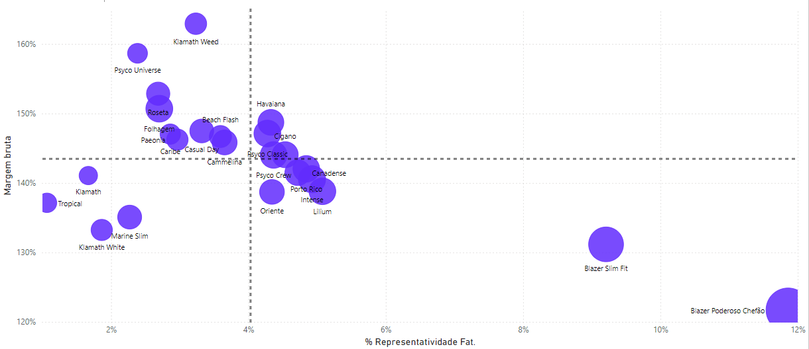

# Análise Comercial - Pinsky Modas

## 1. Descrição do projeto

Este projeto busca transformar a forma como a Pinsky Modas, uma loja de departamento de vestuário, entende e gerencia seu desempenho comercial. O foco é trazer clareza para os desafios diários, oferecendo uma visão completa das vendas, metas e performance de produtos. Usando o Power BI para criar dashboards interativos e intuitivos, pretendemos fornecer as ferramentas certas para facilitar decisões rápidas e bem informadas, além de ajudar a equipe a definir estratégias mais eficazes.

A ideia é ir além dos números, capturando os detalhes que realmente fazem a diferença: entender como as vendas evoluem mês a mês, identificar padrões ou oscilações e perceber quais produtos têm um desempenho que se destaca ou precisa de atenção. E, claro, olhar para as equipes – do gerente ao vendedor – e acompanhar se as metas estão sendo atingidas, onde estão as oportunidades de crescimento e como motivar o time a alcançar resultados ainda melhores.

## 2. Problema de negócio e objetivos

### 2.1 Qual o problema de negócio deste projeto?

A Pinsky Modas enfrenta um desafio crítico no acompanhamento de seus principais indicadores comerciais. Apesar de bater meta nos últimos oito meses do ano, temos uma tendência estacionária nas vendas ao longo do tempo, a loja carece de um sistema eficiente para mapear e monitorar os KPIs essenciais que direcionam o negócio. A falta de uma visão consolidada dificulta a identificação de padrões e a análise das causas de variações no desempenho.

Em resposta a essa necessidade, foi solicitado um dashboard que permita um monitoramento contínuo e detalhado desses indicadores. A ideia é fornecer uma ferramenta que centralize as informações de receita, desempenho das equipes e vendas por produto, facilitando a gestão e permitindo decisões mais rápidas e informadas para alavancar os resultados.

### 2.2 Quais são os conceitos importantes a conhecer no contexto de comercial analisado?

Para entender os indicadores analisados no projeto, é essencial conhecer alguns conceitos fundamentais:

**Conceitos Importantes:**
- **Faturamento:** Refere-se ao total gerado com as vendas, após deduzir descontos, devoluções e taxas aplicáveis. É um indicador chave para medir o desempenho financeiro da loja.
- **Ticket Médio:** Representa o valor médio gasto pelos clientes em cada transação. É calculado dividindo o faturamento total pelo número de vendas realizadas no período analisado, ajudando a identificar tendências de consumo e oportunidades para aumentar o valor médio das compras.
- **Margem Bruta:** Percentual que indica quanto a loja ganha sobre o preço de custo dos produtos vendidos. Calcula-se subtraindo o custo das mercadorias vendidas do faturamento e dividindo o resultado pelo faturamento, expressando a lucratividade antes das despesas operacionais.
- **Faturamento YoY:** Compara o faturamento de um período com o mesmo período do ano anterior. É utilizado para avaliar o crescimento ou declínio das vendas em relação ao ano passado, oferecendo uma visão clara das tendências e sazonalidades.
  
## 3. Pipeline de solução

- **Entendendo o problema de negócio:** Inicialmente, foi realizada uma análise aprofundada para identificar os principais desafios enfrentados pela Pinsky Modas e definir os objetivos que a solução deveria alcançar. Embora as metas mensais tenham sido atingidas na maior parte do ano, observou-se uma tendência estacionária na receita. Nesta etapa, o foco foi entender quais seriam as principais alavancas no setor comercial de vestuário que poderiam impulsionar o crescimento da receita anual, explorando oportunidades para otimizar o desempenho e superar essa estagnação.
- **Preparação e limpeza dos dados:** Os dados foram extraídos da fonte fornecida pela empresa e passaram por um rigoroso processo de tratamento para garantir sua consistência e qualidade. Essa etapa incluiu a remoção de registros duplicados, o tratamento de valores ausentes e a padronização de formatos. Além disso, variáveis adicionais foram criadas quando necessário.
- **Modelagem de Dados:** A modelagem dos dados foi realizada inteiramente no Power Query, onde foram criadas tabelas, realizadas junções e aplicadas regras de negócio específicas. Esse processo garantiu que os dados estivessem estruturados de forma adequada para análises subsequentes.
- **Análise exploratória dos dados:** Os dados disponíveis foram analisados para entender sua distribuição, tendências e possíveis anomalias. Nessa etapa, buscamos identificar padrões nas vendas, variações sazonais e outros fatores que poderiam impactar o desempenho comercial.
- **Criação dos Visuais e Indicadores:** A partir dos dados tratados e modelados, foram criados dashboards com visualizações interativas. Esses visuais abordam os principais KPIs, como faturamento, ticket médio, margens, desempenho por produto e por equipe de vendas permitindo uma análise intuitiva e detalhada.
- **Storrytelling e Apresentação aos StackHolders:** Para assegurar que os insights gerados fossem facilmente compreendidos e aproveitados, os resultados foram apresentados de maneira clara e objetiva. O dashboard foi utilizado como uma ferramenta narrativa para ilustrar o desempenho da loja, enfatizando pontos críticos e destacando oportunidades de melhoria. Atendendo à solicitação do gestor da área, o layout foi concebido em uma única tela, facilitando a visualização e a interpretação rápida das informações.

## 4. Tecnologias e ferramentas

- Power BI
- Estatística
- Power Query
- DAX
- Excel

## 5. Insights e Resultados

### 5.1 - Análise da Receita Geral e Tendências de Crescimento:
  
O faturamento da loja apresentou um crescimento de 3,7% entre 2022 e 2023. Esse aumento, embora positivo, revela uma tendência estacionária ao longo do tempo. A análise dos dados sugere que, apesar de o faturamento ter superado as metas em alguns meses, o ritmo de crescimento não está acelerando de maneira constante. Isso indica que, embora a estratégia atual esteja gerando resultados, há oportunidade para impulsionar ainda mais as vendas.

Uma revisão da estratégia de precificação pode ser um ponto crucial para aumentar a competitividade da loja. Ajustes nos preços, com base na elasticidade da demanda, podem ajudar a melhorar o volume de vendas, especialmente se combinados com campanhas focadas em produtos com maior margem. Além disso, deve-se considerar campanhas de marketing mais agressivas em momentos de baixa sazonalidade, visando melhorar a performance mensal e estabilizar o crescimento de forma mais consistente.

**Recomendações:**

- Implementar uma estratégia dinâmica de preços, ajustando conforme a sazonalidade e demanda do mercado.
- Campanhas promocionais direcionadas para períodos de estagnação nas vendas, focando em impulsionar o faturamento de forma constante.
- Analisar as variáveis de impacto no ticket médio e número de transações, a fim de identificar gatilhos para otimizar tanto a frequência de compra quanto o valor gasto por cliente.

### 5.2 - Desempenho da Equipe de Vendas e Necessidades de Capacitação:

A equipe de vendas da Pinsky Modas demonstrou um bom desempenho em 8 meses de 2023, alcançando um faturamento total de R$ 1.898.013,00 com 1.075 vendas realizadas e um ticket médio de R$ 1.765,59. Esse resultado é amplamente positivo, no entanto, a análise revela uma perda de margem bruta de -5,8%. Isso indica que, apesar do aumento nas vendas e faturamento, o lucro está sendo pressionado.

Essa pressão na margem pode ser atribuída a uma combinação de fatores, como estratégias de desconto, possíveis ineficiências no processo de venda e falta de treinamento em técnicas de venda consultiva que focam em produtos de maior margem. Além disso, a análise individualizada dos vendedores mostrou que cinco deles, que representam 41,7% do total, podem se beneficiar de reciclagens ou capacitações para melhorar seu desempenho.

**Recomendações:**

- Focar em treinamentos voltados para técnicas de venda de produtos de alta margem, ajudando a equipe a aumentar a rentabilidade das vendas.
- Analisar o impacto das políticas de desconto para entender se estão contribuindo para a redução da margem e ajustar essas práticas conforme necessário.
- Implementar um sistema de acompanhamento de performance individual com metas claras e feedback contínuo para garantir que todos os vendedores estejam alinhados com as estratégias da loja.

### 5.3 - Performance de Produtos e Otimização de Margem Bruta:

A análise da performance dos produtos revelou insights importantes para o reposicionamento de marketing e melhorias na margem bruta. O produto com maior margem identificado foi o Blazer Poderoso Chefão, destacando-se como um item de alto valor agregado que pode ser ainda mais explorado em campanhas de marketing específicas. Por outro lado, foi observado que alguns produtos com maior margem bruta estão apresentando desempenho de vendas abaixo do esperado.

Uma estratégia recomendada seria focar em campanhas promocionais direcionadas para esses produtos com margens mais elevadas, mas que estão com vendas insatisfatórias. Ao promover produtos que geram mais lucro, é possível melhorar a rentabilidade geral da loja sem necessariamente depender de um aumento no volume total de vendas. Além disso, a segmentação de clientes com base no número de produtos comprados e suas categorias pode fornecer insights adicionais para personalizar ofertas e direcionar campanhas para os clientes certos, aumentando assim a conversão de vendas.

**Recomendações:**

- Criar campanhas de marketing exclusivas para produtos de maior margem, como o "Blazer Poderoso Chefão", aproveitando seu desempenho financeiro.
- Segmentar a base de clientes com base nas categorias de produtos comprados e histórico de compras, permitindo uma comunicação mais personalizada e eficiente.
- Implementar uma estratégia de cross-selling e up-selling, especialmente para produtos de alto valor, que podem melhorar tanto o ticket médio quanto a margem bruta sem sacrificar o volume de vendas.

